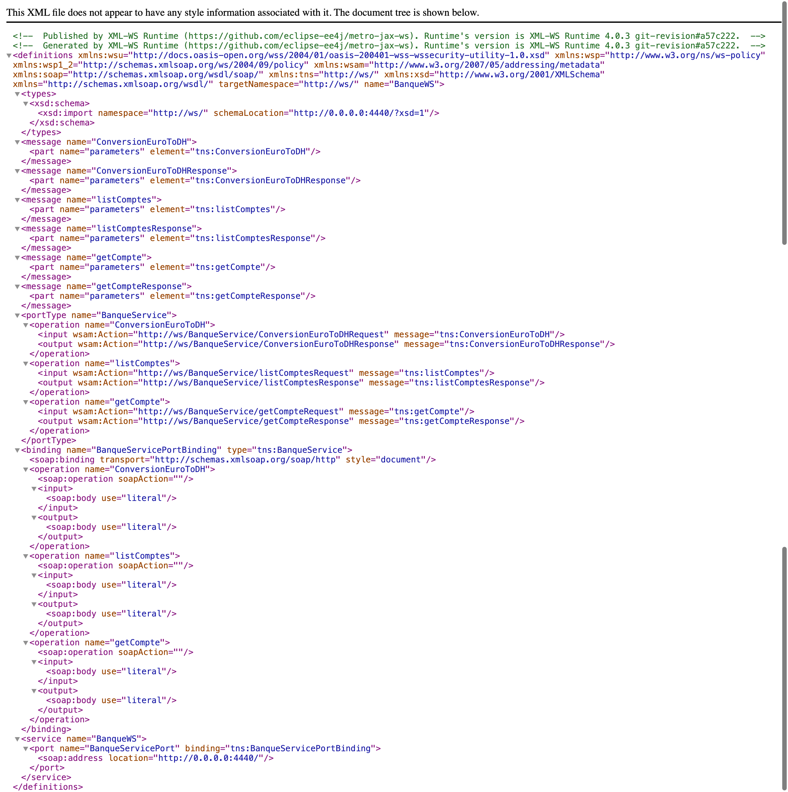

# Compte Rendu : Développement d'un Web Service SOAP

## Description

Ce projet consiste en la création d'un Web Service SOAP permettant de :
- Convertir un montant de l'Euro en Dirhams (DH).
- Consulter les détails d'un compte bancaire.
- Consulter une liste de comptes bancaires.

---

## Architecture

### Classe `Compte`

### Service bancaire

### Déploiement du Web Service
Le Web Service est déployé à l'aide d'un serveur JaxWS simple.

---

## Analyse et Test

### Analyse du WSDL
Le fichier WSDL du Web Service est accessible via un navigateur HTTP.

### Tests des opérations
Les différentes fonctionnalités du Web Service ont été testées avec succès :
- **Conversion d'Euro en DH** :
  

- **Consultation d’un compte** :
  

- **Consultation de la liste des comptes** :
  

---

## Client SOAP Java

Un client SOAP Java a été créé pour interagir avec le Web Service.

### Résultat dans la console

